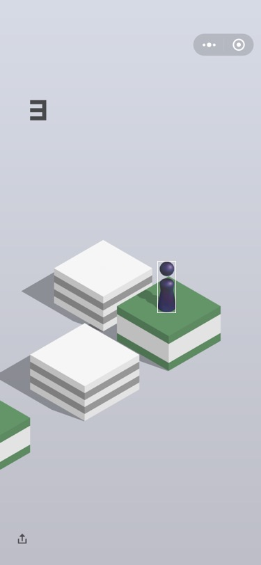
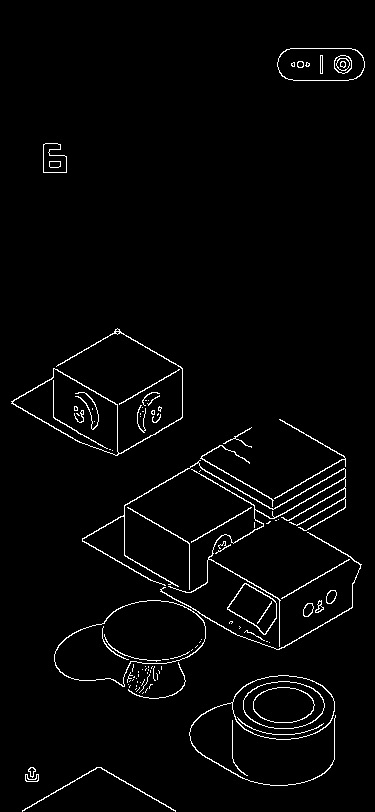

# 在iPhone上开发微信自动跳一跳插件

现在已有的实现方法基本是PC端利用Python来实现的，还得安装很多工具，使用起来非常不方便，这篇文章介绍如何在iOS上利用原生客户端实现自动跳一跳，方便随时使用


### 原理

和PC端实现原理一致，先用系统API进行屏幕截图，利用[OpenCV](https://github.com/opencv/opencv)分析出棋子的位置和目标块的位置，计算出距离乘以系数后得出需要按压的时间，用[FTFakeTouch](https://github.com/devliubo/FTFakeTouch)模拟相应的按压事件就行了

### 如何进行不越狱插件开发

关于这部分，有很多相关的框架，例如[IPAPatch](https://github.com/Naituw/IPAPatch)或者[MonkeyDev](https://github.com/AloneMonkey/MonkeyDev)，这里就不在过多介绍了，可以参考相应的文章或者项目简介

### 实现步骤

##### 1.搭建环境

本例子采用的是`IPAPatch`，我们先取得微信的砸壳文件(自己砸壳或者从越狱渠道下载都行)，然后下载IPAPatch Demo工程，替换`Assets`文件夹下的app.iap为微信的iap砸壳文件，下载`OpenCV`代码编译为`opencv2.framework`添加入工程，下载`FTFakeTouch`工程编译成`FTFakeTouch.a`库添加入工程，新建`WeChatJumpManager`类添加入工程来作为我们实现相关功能的类，这样准备工作就完成了

##### 2.触发方法

我们采用摇一摇的方式开启自动跳的功能，所以添加`UIWindow`的`Category`监听系统的摇一摇事件

```
@implementation UIWindow (Shake)
-(void)motionEnded:(UIEventSubtype)motion withEvent:(UIEvent *)event {
    if (motion == UIEventSubtypeMotionShake) {
        //监听到摇动事件
    }
}
@end
```

##### 3.截图

采用系统的截图方法

```
- (UIImage *)getCurrentScreenShot {
    UIWindow *screenWindow = [UIApplication sharedApplication].keyWindow;
    UIGraphicsBeginImageContextWithOptions(screenWindow.frame.size, NO, [UIScreen mainScreen].scale);
    [screenWindow drawViewHierarchyInRect:screenWindow.frame afterScreenUpdates:YES];
    UIImage *viewImage = UIGraphicsGetImageFromCurrentImageContext();
    UIGraphicsEndImageContext();
    return viewImage;
}
```
用`UIImageToMat`将UIImage转成OpenCV中使用的格式`cv::Mat`

##### 4.定位棋子的位置

OpenCV的`matchTemplate`方法可以根据模板图片查找在对应的目标图片中的位置，正好符合我们的需求，我们先截取一个棋子的模板文件


放入`Assert`文件夹下的`Resource`文件夹下，初始化相应的资源文件传入，获得棋子的位置

```
- (CvPoint)chess_Loc:(cv::Mat)res tempImage:(cv::Mat)temp result:(cv::Mat)result {
    cv::matchTemplate(res, temp, result, CV_TM_SQDIFF);
    double minVal,maxVal;
    CvPoint minLoc,maxLoc,matchLoc;
    IplImage image = IplImage(result);
    cvMinMaxLoc(&image,&minVal,&maxVal,&minLoc,&maxLoc,NULL);
    matchLoc = minLoc; //matchLoc是最佳匹配的区域左上角点
    chessRect = cvRect(matchLoc.x, matchLoc.y, temp.cols, temp.rows);
    //标记出棋子的位置
    cv::rectangle(res, cvRect(matchLoc.x, matchLoc.y, temp.cols, temp.rows), cvScalar(225,225,0));
    return cvPoint(matchLoc.x+temp.cols*0.5,matchLoc.y+temp.rows);
}
```

这步完成我们可以运行测试下，将结果转成`UIImage`存入相册看下棋子的位置是够正确



##### 5.获得下一步的位置

查找下一步位置的关键就是找出下一个方块的位置，我们暂且认为方块的上尖的位置就是下一个方块的位置，关键的方法是边缘检测函数`Canny`

* 先用`cvtColor`将图片转化为灰度图
* 边缘检测前用高斯模糊`GaussianBlur`处理下，方便边缘检测
* `Canny`函数进行边缘检测

我们注意到由于下一步的位置距离上一个位置较近时可能会影响棋子的边缘可能会影响到下一步的位置判断，所以我们根据上一步棋子的位置将它的像素改为0

```
cv::rectangle(res, chessRect, cvScalar(0), -1);
```

由于有效的部分是图片的中间部分，所以我们只处理高度为0.25到0.6之间的部分

根据棋子的位置确定查找的范围，进行行扫描，扫描到的第一个值为255的即返回当前坐标值

实验中发现椭圆形的上尖是条直线，所以我们要获取第一行连续值是255的x值的中点

```
- (CvPoint)nextStep_Loc:(cv::Mat)res chessPoint:(CvPoint)point {
    cvtColor(res, res, CV_BGR2GRAY);
    cv::GaussianBlur(res,res,cvSize(3,3),0);
    cv::Canny(res, res, 3, 9);
    cv::rectangle(res, chessRect, cvScalar(0), -1);
    int minX = 0,maxX = 0;
    int x = 0,y = 0;
    if (point.x < res.cols/2.0) {
        for (int j = res.rows*0.25; j < res.rows*0.6; j++) {
            uchar* ptr = res.ptr<uchar>(j);
            for (int i = res.cols/3.0; i < res.cols; i++) {
                if (ptr[i] == 255) {
                    if (minX == 0) {
                        minX = i;
                    }
                }else{
                    if (minX != 0 && maxX == 0) {
                        maxX = i;
                        x = (int)((maxX-minX)/2.0)+minX;
                        y = j;
                        return cvPoint(x, y);
                    }
                }
            }
        }
    }else{
        for (int j = res.rows*0.25; j < res.rows*0.6; j++) {
            uchar* ptr = res.ptr<uchar>(j);
            for (int i = 0; i < res.cols/3.0*2.0; i++) {
                if (ptr[i] == 255) {
                    if (minX == 0) {
                        minX = i;
                    }
                }else{
                    if (minX != 0 && maxX == 0) {
                        maxX = i;
                        x = (int)((maxX-minX)/2.0)+minX;
                        y = j;
                        return cvPoint(x, y);
                    }
                }
            }
        }
    }
    return cvPoint(0, 0);
}
```

用`circle`函数在我们计算出的位置上画个圈，也保存到相册，验证下结果



##### 6.计算时间

根据上两部算出来的位置算出距离进而得出时间

```
- (CGFloat)timeWithImage:(UIImage *)image {
    @autoreleasepool {
        cv::Mat s;
        UIImageToMat(image, s);
        cv::Mat r = s.clone();
        CvPoint p = [self chess_Loc:s tempImage:chess result:r];
        CvPoint n = [self nextStep_Loc:s chessPoint:p];
        s.release();
        r.release();
        if (n.x != 0&&n.y != 0) {
            double distance = [self distanceBetweenPointA:p pointB:cvPoint(n.x, n.y)];
            return distance*coefficient/1000.0;
        }else{
            return 0.3;
        }
    }
}
```

##### 7.操作按压

随机一个屏幕下部分的点，用`FTFakeTouch`的`longPressAtPoint:duration:`实现长按

```
CGFloat x = (int)(randomRect.origin.x + (arc4random() % (int)randomRect.size.width));
                    CGFloat y = (int)(randomRect.origin.y + (arc4random() % (int)randomRect.size.height));
                    [[FTFakeTouch sharedInstance] longPressAtPoint:CGPointMake(x, y) duration:time];
```


以上就实现了整个需求，大家可以根据自己的手机大小试验出自己的系数
